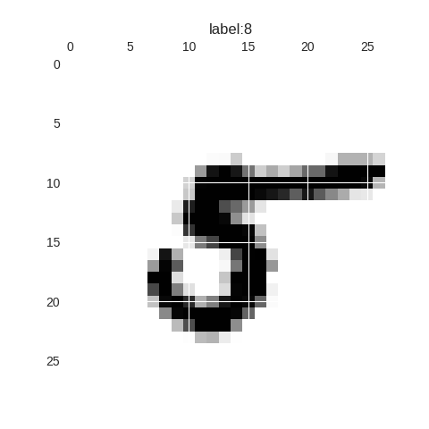
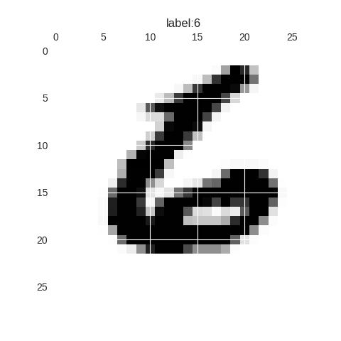

#参数调整过程
迭代次数为200，按照参数调整顺序分别列出对应的精度
* 参数为0.1时，精度达到0.6397
* 参数为0.3时，精度达到0.8332
* 参数为0.5时，精度达到0.8516
* 参数为1时，精度达到0.8717
* 参数为5时，精度达到0.1354
* 参数为3时，精度达到0.4757
* 参数为1.5时，精度达到0.878
* 参数为2时，精度达到0.7853
* 参数为1.7时，精度达到0.8109

其中参数为0.1时找寻找合适的w值速度比较慢，但并没有发生在两个点附近反复跳跃的情况
参数在0.3到1.5时，都可以在200次迭代之内达到80%以上的精度，而当参数为1.5时，速度最快，且最终的精度最高
参数>1.5时，观察精度变化，存在在两个点附近反复跳跃的情况，但最终能够找到正确的点。其中参数为5时这种现象最明显，此时200次以内最高精度不能达到14%

#数字识别示例
**错误示例**
将手写数字5识别为8

**正确示例**


#做作业当中的障碍和问题
##障碍
1. 不熟悉numpy和matplotlib,花了不少时间学习，到目前位置，了解numpy的基本使用方法。matplotlib基本上还不太会用。
2. 对LMS.py中的代码理解的不够，花了不少时间学习理解。
##问题
1. 在LMS初始化权值W和偏差b时为什么要用高斯分布来初始化？这样做有什么好处？能否使用其他方法初始化，比如全部设为1？
2. 对于代码
```
para = (vali - self.active(nu,function="sigmoid")) * self.active(nu,function="sigmoid",derivative=True)
```
其中的激活函数和激活函数的导数由什么意义？这一句的结果para又有什么意义？
3. 对于代码
```
self.grad_ave = np.dot(np.transpose(x), para) / len(data)
self.W = np.add(self.W, eta * self.grad_ave)
```
我的理解是，第一句用来求当前x的平均梯度，第二句是将平均梯度和参数的乘积与现有的权值相加，得到新的权值。而我的问题是，为什么不是与负平均梯度相加？
