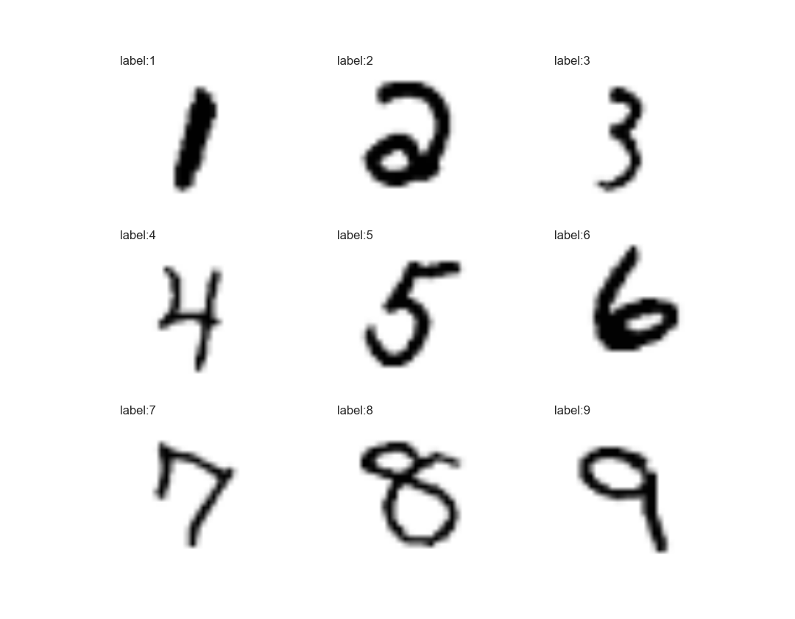

# 手写数字识别

------

## 项目简介
本次课后作业需要完成的任务就是完成手写数字的识别任务，并熟悉一下知识点

* 熟悉数据处理
* 了解函数导数和梯度
* 熟悉矩阵的运算
* 了解loss函数的建立过程




## 数据简介
### 数据获取：
这里用tensorflow提供手写数据标签数据。
> [数据获取地址](https://github.com/YUZIYE/GitChat/tree/master/HandWriting/MNIST_data)

将数据放置于DIR文件夹中
```python
from tensorflow.examples.tutorials.mnist import input_data
mnist = input_data.read_data_sets("DIR/", one_hot=True)
```
**"DIR/"**为数据位置。
### 训练数据
训练过程中可以用mnist获取数据：
```python
#可以直接获取npz文件
import numpy as np
file=np.load("file/to/train.npz")
images=file['images']
labels=file['labels']
#利用函数获取N个训练数据
x, y = mnist.train.next_batch(N)
```
**其中x为图形数据**，其为二维矩阵，矩阵大小为[N, 784]
N为设定的训练数据数量，784为一维矩阵，其代表一个28*28的图形数据。
观察训练数据可以用：
```python
import matplotlib.pyplot as plt
plt.matshow(np.reshape(x[0, :], [28, 28]))
plt.show()
```
**y为标签数据**，其为二维矩阵，矩阵大小为[N,10]
N为设定的训练数据数量，10为一维矩阵。
比如：
数字为2，则标签数字为[0,0,1,0,0,0,0,0,0,0]
数字为0，则标签数字为[1,0,0,0,0,0,0,0,0,0]

### 测试集
训练数据与测试数据不重合，因此在计算过程中可以使用单独的训练集：
```python
file=np.load("file/to/test.npz")
images=file['images']
labels=file['labels']
#图形数据
mnist.test.images
#标签数据
mnist.test.labels
```
------

## 建议
* 使用课上提供的LMS算法示例
* 对于不同参数细节进行调整
* 鼓励加入数据预处理过程

## 要求

- [x] 本项目要求环境为python3.x+numpy
    - 鼓励通过numpy获取训练与验证数据
- [x] 优化参数使得迭代在500次以内精确度到达80%
- [x] 将成功识别的数字与识别失败的数字各一个绘制成图并进行分析
- [x] 利用SVD(或PCA)方法压缩后特征利用单层神经网络进行训练，观察正确率变化，并做记录
    - 分析能SVD或PCA能达到80%正确率所需的特征数量

------

## 提交
- [x] 报告文件，报告内容包括迭代次数，参数调整过程，绘制图形与分析。
- [x] 将训练好的权值W与b进行保存，并提交，保存位置"models/"
numpy保存方式：
```python
import numpy as np
lms=LMS([784,10])

...train step...

np.savez("models/weight.npz", W=lms.W, b=lms.b)

```

## 评估
你的项目将会交由助教进行评审。
