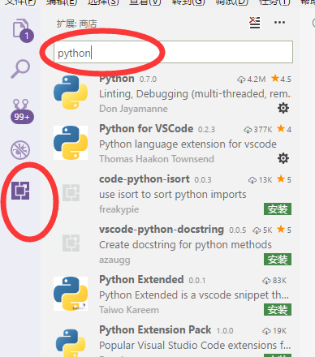

# TensorFlow 章节内容

---------------------

# 代码使用方式
- 提前安装好Anaconda
- 安装好Tensorflow，可以在shell中用命令"pip install tensorflow"安装， **请确认系统路径中包含python路径**。
- 建立文件夹Tensorflow，将内容解压到文件夹中。
- 用[VSCode](https://code.visualstudio.com/)打开文件夹TensorFlow
- 单击安装扩展，并搜索python插件，点击进行安装，这里安装第一个和第二个。

- 打开要运行的python文件单击右键，选择Run Python File in Terminal
- **注意可能遇到的问题是'FileNotFoundError: File b'iris.data.csv' does not exist'** 这个问题可能是直接打开了相应文件，需要设定相应文件位置，或者拷贝到相应文件夹中

------

# TensorFlow章节内容
## TensorFlow基础使用
### 变量定义
### 运算与计算图
### 变量命名
### 定义优化目标
### tensorboard使用

## Basic2文件夹
**源自于TensorFlow Playground**项目
- 可以直接用浏览器打开index.html文件
- 帮助理解多层神经网络变化过程

## 手写数字识别入门
### 学习目标
- 构建单层神经网络
- 接触tensorboard使用
- 初识变量命名作用
- Tensorflow程序改进

## 信用卡欺诈
### 学习目标
- 构建多层神经网络
- 用手写数字最后一个例子进行改进
- 用slim高层次api实现神经网络
- 对形成超曲面进行可视化
- 对散点进行可视化
- 了解过拟合问题
- 初步解决过拟合问题

## 鸢尾花数据
### 学习目标
- 了解ReLU函数优势
- 了解梯度消失现象
- 通过TensorBoard观察梯度消失
- 解决梯度消失问题

----

这部分仅作了解，之后章节具体讲解

### 了解神经网络算法与其他算法的相同点
- 逻辑回归、线性回归等同于单层神经网络
- 部分树等同于多层神经网络
- SVM算法与多层神经网络原理类似
- 贝叶斯分类器等同于单层神经网络